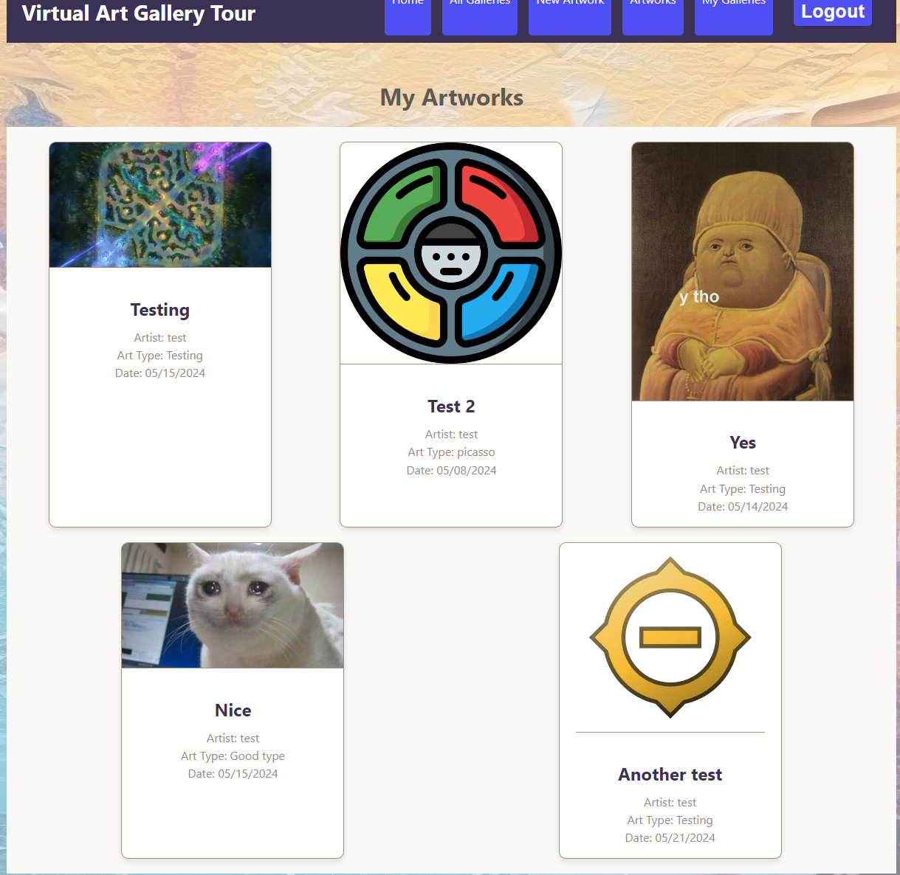
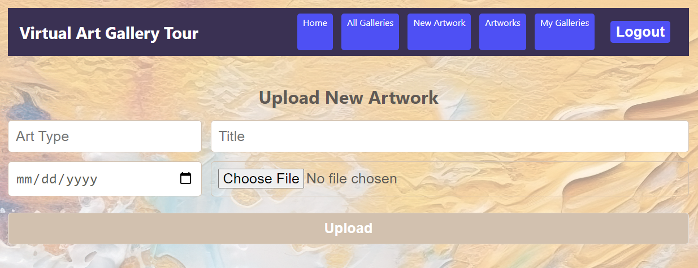

# Art Gallery
Virtual Art Gallery Tour is a web application that allows users to explore, upload, and manage digital artwork. Users can create accounts, log in, and upload new artworks with details such as art type, title, and date. Each artwork has its own detail page where users can comment and delete their own pieces. Additionally, users can organize their artworks into collections called galleries. The app ensures secure user authentication for managing artwork, commenting, and creating galleries.

# Screenshot

# Technologies Used

- Node
- JavaScript
- HTML
- CSS
- Mongoose
- MongoDB
- React
# Getting Started

- [Click to View Project Planning](https://trello.com/b/ugz4oKFh/artgallery)
- [Click to use Art Gallery](https://art-gallery-app-d67b139473e7.herokuapp.com/)

# Next Steps

